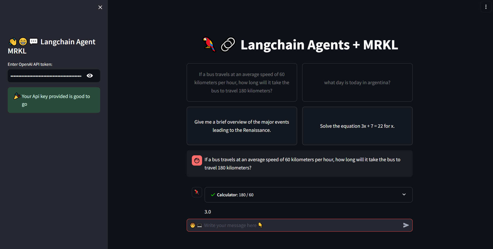

# First-try-streamlit-langchain-agent
Basic Langchain agent or POC, that has the abilities of use math and search from langchain framework

[](https://basic-langchain-agent.streamlit.app/)

## **Support Us**

<a href="https://www.buymeacoffee.com/blazzmocompany"></a>

## Table of Contents

- [Introduction](#introduction)
- [Features](#features)
- [Getting Started](#getting-started)
  - [Prerequisites](#prerequisites)
  - [Installation](#installation)
    - [Try it Online](#try-it-online)
    - [Or Try it Locally](#or-try-it-locally)
- [Usage](#usage)
- [Contributing](#contributing)
- [License](#license)

## Introduction

Langchain is a wide framework used to create agents a rag systems with many providers that is helpful to create AI-Driven tools the purpose of this project is to show a POC, with math and duckgogo search, also includes some pre-recorded runs that lets you see the power of this agent from langchain with streaming capabilities and memory that remember what you ask, this project uses the OpenAI models provider.

## Features

- User-friendly interface to solve mathematics problems.
- Integration with OpenAI model for natural language processing and chatbot functionalities.
- Simplified the proccess to search information.
- This project is an POC in order to show what it can be done with langchain.

## Getting Started

### Prerequisites

Before you begin, ensure you have met the following requirements:

- [Python](https://www.python.org/) (>= 3.10) installed on your system.
- Dependencies mentioned in the `requirements.txt` file.

### Installation
- **Try it Online**
  
  - No need to insatall
  - [](https://basic-langchain-agent.streamlit.app/)
- **Or Try it Locally**

1. Clone this repository:

   ```bash
   git clone https://github.com/IA-Programming/First-try-streamlit-langchain-agent.git
   ```

2. Navigate to the project directory:

    ```bash
    cd OpenInterpreterUI
    ```

3. Don't forget that you want to use a branch of the repositorie:

    ```bash
    git checkout -b DemoAgent origin/DemoAgent
    ```

4. Install the required dependencies using pip:

    ```bash
    pip install -r requirements.txt
    ```

## Usage

1. To run the OpenInterpreterUI, use the following command:
    ```bash
    streamlit run demo_app.py --server.port 8501
    ```
2. Access the application in your web browser at http://localhost:8501.
3. Use the GUI to see with you eyes the power of langchain and interact with this OpenAI application.

## Contributing

Contributions are welcome! If you'd like to contribute to this project, please follow these steps:
1. Fork the repository.
2. Create a new branch for your feature or bug fix.
3. Make your changes and commit them with a clear commit message.
4. Push your changes to your fork.
5. Create a pull request to merge your changes into this branch of the repository.

## License

This project is licensed under the MIT License - see the [LICENSE](LICENSE) file for details.